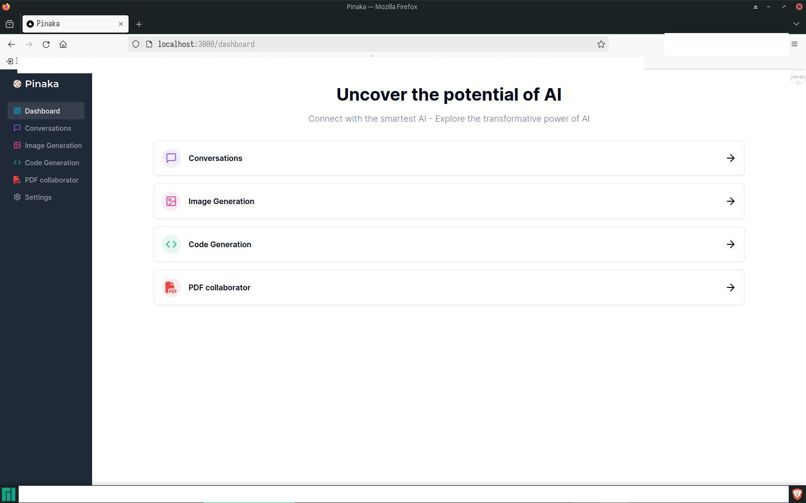
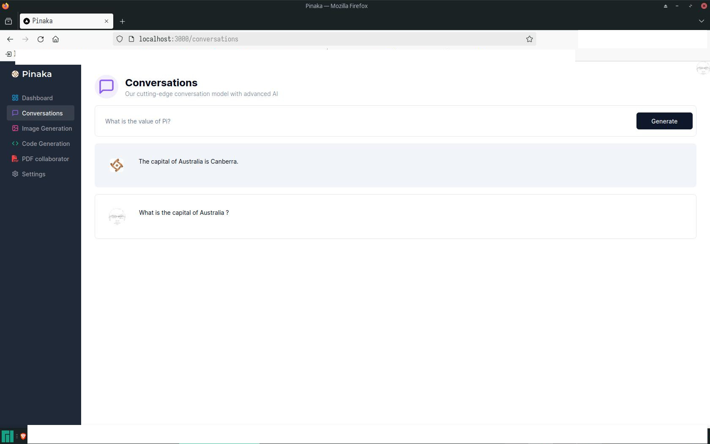

## Getting Started

This is a prototype project built to demonstrate the capabilities of AI.
As of now it is tested only for local environment. Do not use it for production.

## Features working

1. Conversations
2. Code Generation
3. Image Generation

First, run the development server:

```bash
npm run dev
# or
yarn dev

Open [http://localhost:3000](http://localhost:3000) with your browser to see the result.
```

## Images

### Dashboard



### Conversations


